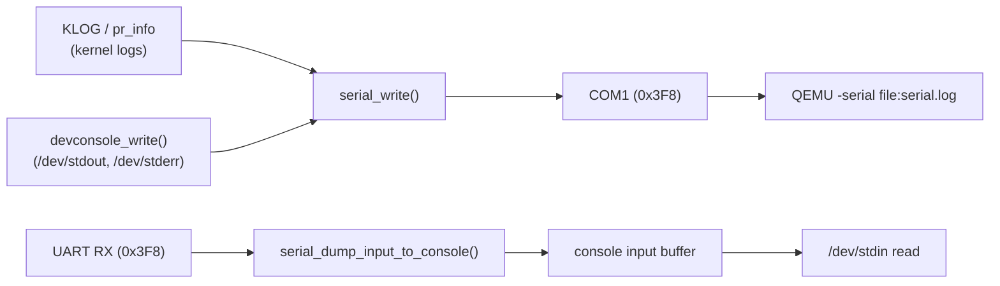
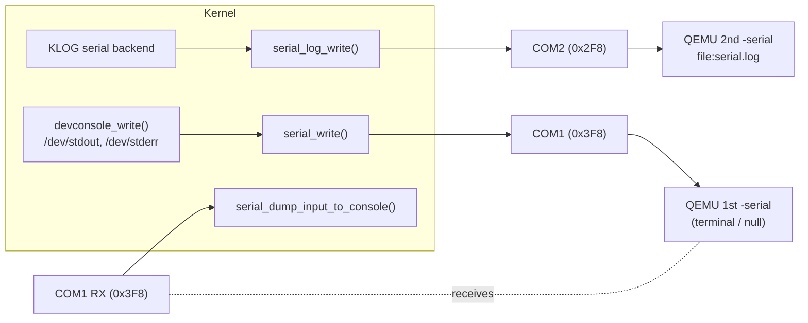
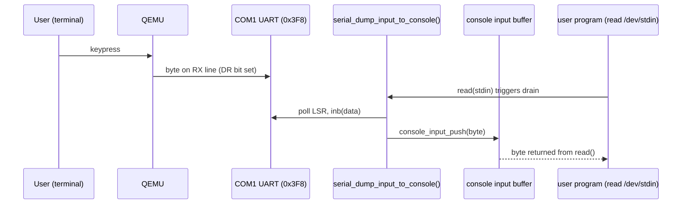

# Dual Serial Ports: Separating the Interactive Console from Kernel Logs

## 1. Summary

Kernel-V originally drove a **single** 16550 UART (COM1, `0x3F8`) for *everything*:
kernel log output (`KLOG`) **and** the user-facing console (`/dev/stdin`,
`/dev/stdout`, `/dev/stderr`). This made interactive standard-input testing
impossible and caused logs and program output to interleave on one wire.

The fix splits serial traffic across **two** UARTs:

| Port | I/O base | Role | Emitted by |
|------|----------|------|------------|
| **COM1** | `0x3F8` | Interactive user console (stdin/stdout/stderr) | `serial_write` / `serial_putc`, `serial_dump_input_to_console` |
| **COM2** | `0x2F8` | Kernel log output only (`KLOG`) | `serial_log_write` (via the logging backend) |

QEMU maps the **first** `-serial` device to COM1 and the **second** to COM2, so
logs can be captured to a file while the console is driven interactively from a
terminal — with no interleaving.

---

## 2. Background

### 2.1 The single-UART architecture

Every byte the kernel put on the wire went through one port:



### 2.2 Input has only one source

The kernel has **no PS/2 keyboard driver**. The *only* producer of console
input is the serial receive path:

```
UART RX (0x3F8) → serial_dump_input_to_console() → console_input_push() → /dev/stdin
```

---

## 3. The Problem

To run the kernel while capturing logs, the build used:

```makefile
QEMU_SERIAL ?= -serial file:serial.log
```

`-serial file:...` is a **write-only** backend. It captures transmitted bytes
into a file but provides **no receive channel**. Consequences:

1. **Interactive stdin was impossible.** With COM1 bound to a file, the UART RX
   line never became ready, so `serial_dump_input_to_console()` always found an
   empty buffer and `/dev/stdin` reads returned `ERR_AGAIN` forever. A program
   that loops on `read(stdin)` would spin indefinitely.
2. **Switching to an interactive backend polluted the terminal.** Using
   `-serial mon:stdio` made input work, but because logs *and* console output
   shared COM1, the terminal was flooded with `KLOG` lines interleaved with the
   program's output.

The root cause is architectural: **two logically distinct streams (diagnostics
vs. interactive console) were multiplexed onto one physical UART.**

---

## 4. The Solution

Give each stream its own UART:

- **COM1 (`0x3F8`)** — interactive user console (stdin/stdout/stderr).
- **COM2 (`0x2F8`)** — kernel log output only.



Because the two streams are now on different ports, the console can be bound to
an interactive terminal while logs stream to a file, and neither contaminates
the other.

---

## 5. Implementation

### 5.1 Serial driver — port-parameterized helpers

`kernel/drivers/serial/serial.c` was refactored so the low-level routines take a
port base, and the public API selects the correct port. `serial_init()`
initializes **both** UARTs.

```c
#define SERIAL_COM1 0x3F8   /* interactive user console */
#define SERIAL_COM2 0x2F8   /* kernel log output */

static void serial_port_init(uint16_t base);                    /* configures one UART   */
static void serial_port_putc(uint16_t base, char c);            /* one byte to `base`    */
static void serial_port_write(uint16_t base, const char *, size_t);

void serial_init(void) {          /* bring up BOTH ports */
    serial_port_init(SERIAL_COM1);
    serial_port_init(SERIAL_COM2);
}

/* --- COM1: interactive user console --- */
void serial_putc(char c);                        /* -> SERIAL_COM1 */
void serial_write(const char *data, size_t len); /* -> SERIAL_COM1 */

/* --- COM2: kernel log output --- */
void serial_log_write(const char *data, size_t len); /* -> SERIAL_COM2 */
```

Input helpers (`serial_getc_nonblocking`, `serial_dump_input_to_console`) read
from **COM1** only, since that is the interactive console port.

### 5.2 Public header

`kernel/include/drivers/serial.h` declares the new log entry point:

```c
/**
 * serial_log_write - write kernel log bytes to the dedicated log UART (COM2).
 * Kept separate from serial_write (COM1 console) so KLOG output never
 * interleaves with interactive stdin/stdout traffic.
 */
void serial_log_write(const char *data, size_t len);
```

### 5.3 Logging backend routes to COM2

`kernel/lib/logging/backend.c` — the `KLOG` serial backend now targets the log
port instead of the console port:

```c
void serial_backend(const char *msg, size_t len, char color) {
    (void)color;
    serial_log_write(msg, len);   /* COM2, was serial_write() -> COM1 */
}
```

### 5.4 Device console output stays on COM1

`kernel/fs/devfs.c` (`devconsole_write`, backing `/dev/stdout` and
`/dev/stderr`) continues to call `serial_write()`, which now targets COM1 — the
interactive console — exactly as intended.

---

## 6. QEMU Wiring

QEMU assigns serial ports **in order**: the first `-serial` becomes COM1, the
second becomes COM2. The build exposes each backend as an overridable variable
(`Makefile`):

```makefile
QEMU_CONSOLE_BACKEND ?= null              # COM1 (1st -serial): user console
QEMU_LOG_BACKEND     ?= file:serial.log   # COM2 (2nd -serial): kernel logs
QEMU_SERIAL          ?= -serial $(QEMU_CONSOLE_BACKEND) -serial $(QEMU_LOG_BACKEND)
```

> **Important:** COM2 only exists inside the guest when a **second** `-serial`
> device is supplied. If it is omitted, writes to `0x2F8` are silently dropped
> and all logs vanish. Always keep both `-serial` flags (the defaults do this).

### Default (automated / headless)

| Port | Backend | Purpose |
|------|---------|---------|
| COM1 | `null` | Console output discarded (no interaction needed) |
| COM2 | `file:serial.log` | Logs captured for assertions / inspection |

### Interactive

Override the console backend to attach a terminal while logs keep flowing to the
file:

```bash
make run QEMU_CONSOLE_BACKEND=mon:stdio QEMU_DISPLAY="-display none"
```

A convenience target is provided in `makefiles/targets.mk`:

```makefile
run-console: $(DISK_IMG)    ## COM1 on terminal, logs -> serial.log
	$(QEMU) $(QEMU_DRIVE_FLAGS)$< -serial mon:stdio -serial file:serial.log \
	        -display none $(QEMU_EXTRA)
```

```bash
make run-console      # type into the terminal; logs go to serial.log
```

Quit QEMU with `Ctrl-A` then `X`; open the QEMU monitor with `Ctrl-A` then `C`.

---

## 7. Interactive stdin path (end to end)



---

## 8. Verification

After a clean build, a headless run confirms the separation:

- **Kernel logs (`KLOG`) present in `serial.log`** — routed via COM2.
- **User-console strings absent from `serial.log`** — e.g. program banners such
  as `"syscall_stdio test starting"` and `"type input"` no longer appear,
  because they now go to COM1 (bound to `null` in the default headless config).

This proves diagnostics and interactive console output are cleanly separated
onto independent ports.

---

## 9. Files Changed

| File | Change |
|------|--------|
| `kernel/drivers/serial/serial.c` | Port-parameterized helpers; `serial_init()` brings up COM1 + COM2; added `serial_log_write()` (COM2); console I/O and input stay on COM1 |
| `kernel/include/drivers/serial.h` | Declared `serial_log_write()` |
| `kernel/lib/logging/backend.c` | `serial_backend` now calls `serial_log_write()` (COM2) |
| `Makefile` | Split `QEMU_SERIAL` into `QEMU_CONSOLE_BACKEND` (COM1) + `QEMU_LOG_BACKEND` (COM2) |
| `makefiles/targets.mk` | Added `run-console` convenience target |

---

## 10. Quick Reference

```bash
# Automated / headless: console discarded, logs -> serial.log
make run

# Interactive: console on this terminal, logs -> serial.log
make run-console

# Manual override
make run QEMU_CONSOLE_BACKEND=mon:stdio QEMU_DISPLAY="-display none"
```

| Need | Port | Backend |
|------|------|---------|
| Read kernel logs | COM2 (`0x2F8`) | `file:serial.log` |
| Type into `/dev/stdin` | COM1 (`0x3F8`) | `mon:stdio` |
